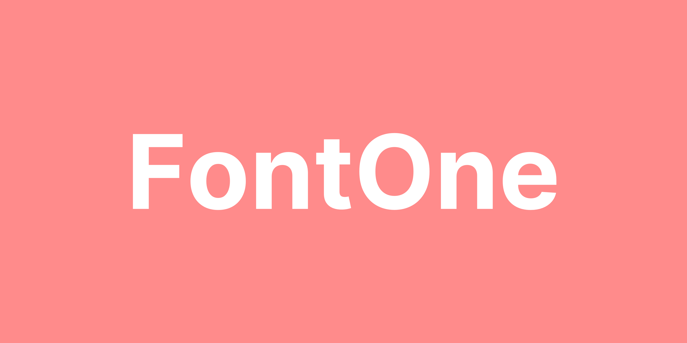

<ImageRowStack>

</ImageRowStack>

<ImageFullWidth>

</ImageFullWidth>

<ImageRowStack>

</ImageRowStack>

<ImageFullWidth>

</ImageFullWidth>

<ImageRowStack>

</ImageRowStack>

<ImageFullWidth>

</ImageFullWidth>

<ImageRowStack>

</ImageRowStack>

<ImageFullWidth>

</ImageFullWidth>
