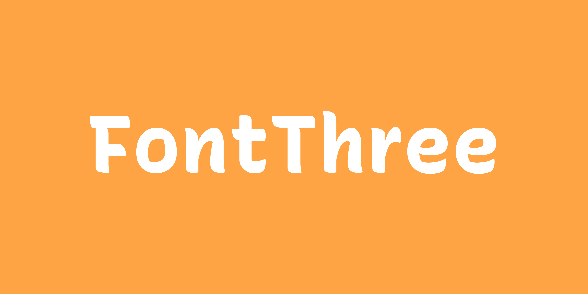

import ImageRowStack from '../../components/image-rowstack';
import ImageFullWidth from '../../components/image-fullwidth';

<ImageRowStack>

</ImageRowStack>

<ImageFullWidth>

</ImageFullWidth>

<ImageRowStack>

</ImageRowStack>

<ImageFullWidth>

</ImageFullWidth>

<ImageRowStack>

</ImageRowStack>

<ImageFullWidth>

</ImageFullWidth>

<ImageRowStack>

</ImageRowStack>

<ImageFullWidth>

</ImageFullWidth>
